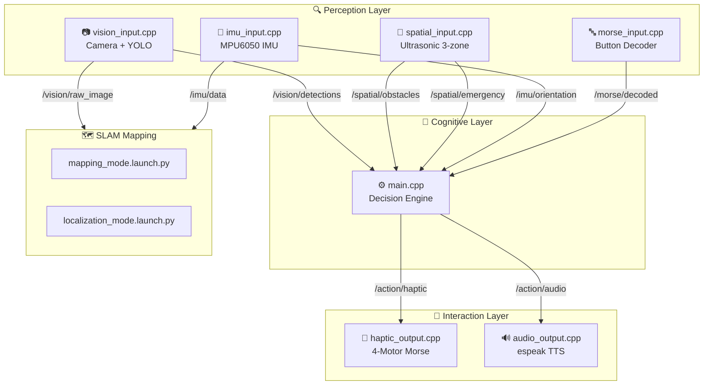

<p align="center">
  
  
  
  
  
  
</p>

<h1 align="center">🦯 Smart Spectacles + Smart Stick</h1>
<h3 align="center">Assistive Navigation System for Blind & Deaf-Blind Users</h3>

<p align="center">
  A dual-mode, multi-sensory assistive system that combines YOLO-based computer vision, spatial sensing, and <b>structured Morse code haptics</b> to enable safe, independent navigation — fully offline on a Raspberry Pi 4.
</p>

---

## 🌟 Key Innovation

> **Replace unstructured vibrations with a structured Morse-code-based haptic language.**

Traditional assistive devices use simple buzzing patterns. This system introduces a complete Morse communication protocol — enabling deaf-blind users to receive **detailed information** (object names, directions, alerts) through precisely timed vibration pulses.

---

## 📋 Table of Contents

- [Features](#-features)
- [System Architecture](#-system-architecture)
- [Operating Modes](#-operating-modes)
- [Hardware Requirements](#-hardware-requirements)
- [Project Structure](#-project-structure)
- [Module Details](#-module-details)
- [Morse Code Protocol](#-morse-code-protocol)
- [Priority Decision Engine](#-priority-decision-engine)
- [Sensor Zones](#-sensor-zones)
- [ROS2 Topic Map](#-ros2-topic-map)
- [Build & Run](#-build--run)
- [Optimizations](#-raspberry-pi-4-optimizations)
- [License](#-license)

---

## ✨ Features

| Feature | Description |
|---------|-------------|
| 🎯 **YOLO Object Detection** | Real-time obstacle & hazard detection using ONNX inference |
| 📡 **3-Zone Spatial Sensing** | Ultrasonic sensors covering left, center, and right |
| 🧭 **IMU Orientation Tracking** | Fall detection, stumble alerts, and head tilt warnings |
| 🔤 **Morse Code I/O** | Full bidirectional Morse communication for deaf-blind users |
| 🗺️ **SLAM Navigation** | RTAB-Map based mapping and localization |
| 🧠 **Priority Decision Engine** | 5-level prioritized sensor fusion |
| 🔊 **Text-to-Speech** | espeak-ng TTS with urgency-adjusted rate and pitch |
| 📳 **Directional Haptics** | 4-motor vibration with PWM intensity control |
| 🔌 **Fully Offline** | No internet required — all processing on-device |
| 💰 **Low Cost** | Complete system under ₹18,500 (~$220) |

---

## 🏗 System Architecture



The system follows a **3-layer architecture**:

1. **Perception Layer** — Sensors and input processing (camera, ultrasonic, IMU, Morse button)
2. **Cognitive Layer** — Central decision engine with prioritized sensor fusion
3. **Interaction Layer** — Output to user via haptic vibrations and audio speech

---

## 🔁 Operating Modes

### Mode 1: Blind Users
- 🔊 Audio speech announcements (TTS)
- 📳 Basic directional vibration alerts
- Full object identification with spoken descriptions

### Mode 2: Deaf-Blind Users
- 📳 **Full Morse code haptic communication** — all information encoded as vibration pulses
- 📳 Directional vibration for spatial awareness
- 🚫 No audio output
- 🔤 Morse input for user-initiated communication (SOS, HELP, etc.)

> **Switch modes at runtime** by publishing to `/system/mode` topic:
> ```bash
> ros2 topic pub /system/mode std_msgs/String "data: 'deaf_blind'"
> ```

---

## 🔧 Hardware Requirements

| Component | Specification | Est. Cost (₹) |
|-----------|--------------|----------------|
| Raspberry Pi 4 | 4GB RAM | ₹5,000 |
| Pi Camera / USB Camera | 640x480 capable | ₹1,500 |
| HC-SR04 Ultrasonic × 3 | 2cm – 4m range | ₹450 |
| MPU6050 IMU | 6-axis accelerometer + gyro | ₹200 |
| Vibration Motors × 4 | Coin-type / ERM | ₹400 |
| Motor Driver | L298N or similar | ₹250 |
| Push Button (Morse) | Tactile switch | ₹50 |
| Speaker / Earphone | 3.5mm audio out | ₹300 |
| Power Bank | 10000mAh, 5V/3A | ₹1,000 |
| Frame + Enclosure | 3D printed / DIY | ₹1,500 |
| Wires, PCB, misc | — | ₹500 |
| **Total** | | **~₹11,150 – ₹18,500** |

---

## 📂 Project Structure

```
smart_assistive_ws/
├── CMakeLists.txt                              # Build config (ROS2 ament)
├── package.xml                                 # ROS2 dependencies
├── README.md
└── src/
    ├── perception_layer/
    │   ├── vision_input.cpp                    # Camera + YOLO ONNX inference
    │   ├── spatial_input.cpp                   # Ultrasonic 3-zone obstacle detection
    │   ├── imu_input.cpp                       # MPU6050 orientation + fall detection
    │   └── morse_input.cpp                     # Morse code button input decoder
    ├── cognitive_layer/
    │   └── main.cpp                            # Central decision engine
    ├── interaction_layer/
    │   ├── haptic_output.cpp                   # Vibration motor + Morse output
    │   └── audio_output.cpp                    # espeak-ng text-to-speech
    ├── slam_mapping/
    │   ├── launch/
    │   │   ├── mapping_mode.launch.py          # SLAM map building (caregiver)
    │   │   └── localization_mode.launch.py     # Runtime localization
    │   └── maps/
    │       └── house_map.db                    # RTAB-Map database (generated)
    └── models/
        └── best.onnx                           # YOLO model (user-provided)
```

---

## 📦 Module Details

### Perception Layer

| Module | File | Description |
|--------|------|-------------|
| **Vision** | `vision_input.cpp` | Captures frames from USB/CSI camera. Runs YOLO inference via OpenCV DNN (supports both YOLOv5 & YOLOv8 output formats). Publishes JSON detections with label, confidence, bounding box, distance estimate, hazard flag, and spatial position (left/center/right). Frame skipping for Pi performance. |
| **Spatial** | `spatial_input.cpp` | Reads 3 HC-SR04 ultrasonic sensors (left/center/right) via GPIO trigger-echo. Applies median filter (window=5) for noise rejection. Classifies each zone as emergency / danger / caution / clear. Publishes emergency stop on close proximity. |
| **IMU** | `imu_input.cpp` | Reads MPU6050 over I2C. Applies complementary filter (α=0.96) to fuse accelerometer + gyroscope into stable pitch, roll, yaw. Detects falls (>60° tilt), stumbles (high angular velocity), and head tilt (overhead obstacle awareness). Publishes standard `sensor_msgs/Imu` for SLAM. |
| **Morse Input** | `morse_input.cpp` | Polls a tactile button at 100 Hz. Classifies press duration as dot (<350ms) or dash (≥350ms). Detects letter gaps (300ms) and word gaps (700ms) to decode characters. Supports special commands: SOS, HELP, REPEAT, END. Includes simulation mode for testing without hardware. |

### Cognitive Layer

| Module | File | Description |
|--------|------|-------------|
| **Decision Engine** | `main.cpp` | Subscribes to all perception topics. Applies a 5-level priority system to fuse alerts. Dispatches action commands to haptic and audio nodes based on operating mode. Includes alert suppression (cooldown timers) to prevent cognitive overload. Runtime mode switching via `/system/mode`. |

### Interaction Layer

| Module | File | Description |
|--------|------|-------------|
| **Haptic Output** | `haptic_output.cpp` | Controls 4 vibration motors via software PWM (left/center/right for direction + dedicated Morse motor). Worker thread for non-blocking Morse encoding. Emergency pattern: rapid full-intensity pulses on all motors. Urgency mapped to PWM intensity (30–100%). |
| **Audio Output** | `audio_output.cpp` | Text-to-speech using espeak-ng library (with system command fallback). Priority queue with emergency preemption. Adjusts speech rate and pitch based on urgency. Cooldown between utterances to prevent overlap. Only active in Blind mode. |

### SLAM

| Module | File | Description |
|--------|------|-------------|
| **Mapping** | `mapping_mode.launch.py` | Launches RTAB-Map in mapping mode for a caregiver to build an environment map. ORB feature detector. Pi-optimized parameters (200 max keypoints, 300 node memory limit). Includes visual odometry and static TF publishers. |
| **Localization** | `localization_mode.launch.py` | Loads pre-built map for runtime localization. Lower detection rate (3 Hz vs 5 Hz) for battery savings. No new map nodes added — localization only. |

---

## 🔤 Morse Code Protocol

### Timing Specification

| Element | Duration | Description |
|---------|----------|-------------|
| **Dot (·)** | 200 ms | Short haptic pulse |
| **Dash (—)** | 600 ms | Long haptic pulse |
| **Element gap** | 100 ms | Silence between dots/dashes within a letter |
| **Letter gap** | 300 ms | Silence between letters |
| **Word gap** | 700 ms | Silence between words |

### Special Commands

| Morse Sequence | Command | Action |
|---------------|---------|--------|
| `..—.` | SOS | Triggers emergency alert |
| `-..---` | HELP | Requests caregiver assistance |
| `.-.-` | REPEAT | Repeats last message |
| `...-.-` | END | End of message marker |

### Example Output

To communicate **"CAR LEFT"** to a deaf-blind user:
```
C: -.-.  →  [600ms ON] [100ms OFF] [200ms ON] [100ms OFF] [600ms ON] [100ms OFF] [200ms ON]
           [300ms letter gap]
A: .-    →  [200ms ON] [100ms OFF] [600ms ON]
           [300ms letter gap]
R: .-.   →  [200ms ON] [100ms OFF] [600ms ON] [100ms OFF] [200ms ON]
           [700ms word gap]
L: .-..  →  [200ms ON] [100ms OFF] [600ms ON] [100ms OFF] [200ms ON] [100ms OFF] [200ms ON]
... (continues)
```

---

## 🧠 Priority Decision Engine

The cognitive layer processes all sensor inputs and makes prioritized decisions:

| Priority | Level | Type | Example | Urgency | Response |
|----------|-------|------|---------|---------|----------|
| **0** | 🔴 Critical | Emergency | Obstacle < 30cm, fall detected | 10 | Immediate — all motors pulse, interrupt speech |
| **1** | 🟠 High | Hazard | Moving vehicle, SOS command | 7–8 | Fast directional vibration + urgent speech |
| **2** | 🟡 Medium | Navigation | Obstacle in caution zone | 4–5 | Moderate vibration + spoken warning |
| **3** | 🔵 Low | Communication | Morse text relay | 3 | Queued Morse output |
| **4** | ⚪ Info | Information | Object identification | 2 | Spoken description (blind mode only) |

> **Alert suppression**: Same-type alerts are suppressed within cooldown windows (500ms for hazards, 1000ms for info) to prevent cognitive overload.

---

## 📡 Sensor Zones

The smart stick uses 3 ultrasonic sensors for directional obstacle detection:

```
         ┌─────────────────┐
         │   CENTER (17,27) │
         │   ┌───────────┐ │
         │   │           │ │
    LEFT │   │  Stick    │ │ RIGHT
  (23,24)│   │  Handle   │ │(5,6)
         │   │           │ │
         │   └───────────┘ │
         └─────────────────┘
              GPIO Pins
```

| Zone | Distance | Alert Level | Haptic Response |
|------|----------|-------------|-----------------|
| 🔴 **Emergency** | < 30 cm | Immediate stop | All motors full blast, rapid pulse |
| 🟠 **Danger** | < 80 cm | Strong warning | Directional motor at 79% intensity |
| 🟡 **Caution** | < 1.5 m | Mild warning | Directional motor at 58% intensity |
| 🟢 **Clear** | > 1.5 m | No alert | — |

---

## 📡 ROS2 Topic Map

```
┌──────────────────────────────────────────────────────────────────┐
│                        ROS2 TOPICS                               │
├──────────────────────┬───────────────────────────────────────────┤
│ PERCEPTION           │                                           │
│  /vision/detections  │ JSON: YOLO detections (label, conf, pos) │
│  /vision/raw_image   │ sensor_msgs/Image → SLAM                 │
│  /spatial/obstacles  │ JSON: 3-zone distances (L/C/R)           │
│  /spatial/emergency  │ JSON: emergency stop trigger              │
│  /spatial/range      │ sensor_msgs/Range per sensor              │
│  /imu/orientation    │ JSON: pitch, roll, yaw, alerts            │
│  /imu/data           │ sensor_msgs/Imu → SLAM                   │
│  /morse/decoded      │ JSON: full decoded text                   │
│  /morse/raw          │ current dot/dash sequence                 │
│  /morse/char         │ JSON: latest char or command              │
├──────────────────────┼───────────────────────────────────────────┤
│ ACTIONS              │                                           │
│  /action/haptic      │ JSON: haptic motor commands               │
│  /action/audio       │ JSON: TTS speech commands                 │
├──────────────────────┼───────────────────────────────────────────┤
│ SYSTEM               │                                           │
│  /cognitive/status   │ JSON: system health                       │
│  /system/mode        │ Mode switch: blind / deaf_blind           │
└──────────────────────┴───────────────────────────────────────────┘
```

---

## 🚀 Build & Run

### Prerequisites

- **Raspberry Pi 4** (4GB) with Ubuntu 22.04
- **ROS2 Humble** installed
- **OpenCV 4.x** (`sudo apt install libopencv-dev`)
- **espeak-ng** (`sudo apt install espeak-ng libespeak-ng-dev`)
- **wiringPi** (for GPIO on Raspberry Pi)
- **RTAB-Map** (`sudo apt install ros-humble-rtabmap-ros`)

### Build

```bash
# Clone into your ROS2 workspace
cd ~/ros2_ws/src
git clone https://github.com/your-username/smart_assistive_ws.git

# Install ROS2 dependencies
cd ~/ros2_ws
rosdep install --from-paths src --ignore-src -y

# Build
colcon build --packages-select smart_assistive_system

# Source the workspace
source install/setup.bash
```

### Run All Nodes

```bash
# Terminal 1 — Perception
ros2 run smart_assistive_system vision_input_node &
ros2 run smart_assistive_system spatial_input_node &
ros2 run smart_assistive_system imu_input_node &
ros2 run smart_assistive_system morse_input_node &

# Terminal 2 — Cognitive Engine
ros2 run smart_assistive_system cognitive_engine_node

# Terminal 3 — Interaction
ros2 run smart_assistive_system haptic_output_node &
ros2 run smart_assistive_system audio_output_node &
```

### SLAM (One-Time Setup)

```bash
# Step 1: Build map (caregiver walks through environment)
ros2 launch smart_assistive_system mapping_mode.launch.py

# Step 2: Use map for localization (during normal operation)
ros2 launch smart_assistive_system localization_mode.launch.py
```

### YOLO Model Setup

```bash
# Install ultralytics
pip install ultralytics

# Export YOLOv8 nano to ONNX (recommended for Pi)
python3 -c "
from ultralytics import YOLO
model = YOLO('yolov8n.pt')
model.export(format='onnx', imgsz=416, opset=12)
"

# Copy to project
cp yolov8n.onnx src/models/best.onnx
```

---

## ⚡ Raspberry Pi 4 Optimizations

| Optimization | Detail |
|-------------|--------|
| **ARM NEON** | Compiler flags: `-mcpu=cortex-a72 -mfpu=neon-fp-armv8` |
| **Frame Skipping** | YOLO inference on every 2nd frame (configurable) |
| **Input Resolution** | 416×416 inference size (vs. 640×640 default) |
| **Feature Detector** | ORB (fastest on ARM) instead of SIFT/SURF |
| **Memory Limit** | RTAB-Map capped at 300 working memory nodes |
| **Thread Budget** | 2 threads for inference, 1 each for haptic/audio workers |
| **Sensor Filtering** | Median filter (window=5) on ultrasonic to reduce noisy GPIO reads |
| **Camera Buffer** | Buffer size = 1 to minimize capture latency |
| **Conditional Compile** | `#ifdef HAS_WIRINGPI` / `HAS_ONNXRUNTIME` / `HAS_ESPEAK` — runs on desktop without hardware |

---

## ⚠️ Constraints & Limitations

- Must work **fully offline** — no cloud dependency
- Must remain **under ₹18,500** total BOM cost
- Must be **lightweight and wearable** (spectacles + stick form factor)
- Must **minimize cognitive overload** — priority system + alert suppression
- YOLO accuracy depends on training data — custom models recommended for Indian conditions (autos, cows, potholes, etc.)
- Visual odometry (monocular) has limited depth accuracy — ultrasonic provides ground truth for close range

---

## 🤝 Contributing

Contributions are welcome! Areas where help is needed:

- [ ] Custom YOLO model trained on Indian street obstacles
- [ ] Battery optimization and power management
- [ ] Braille display integration for deaf-blind users
- [ ] Mobile app for caregiver remote monitoring
- [ ] Multi-language TTS support (Hindi, Tamil, etc.)
- [ ] LiDAR integration for improved depth sensing

---

## 📄 License

This project is licensed under the **Apache License 2.0** — see the [LICENSE](LICENSE) file for details.

---

<p align="center">
  <b>Built with ❤️ for accessibility and independence</b><br/>
  <i>Making the world navigable for everyone</i>
</p>
